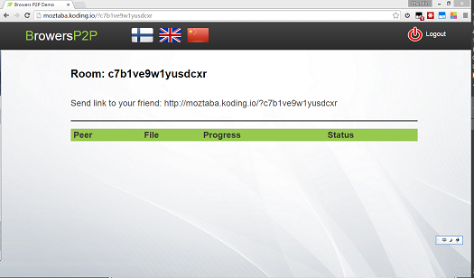
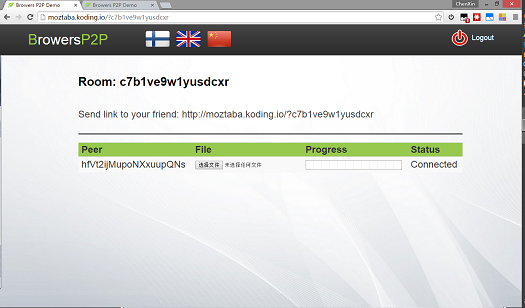
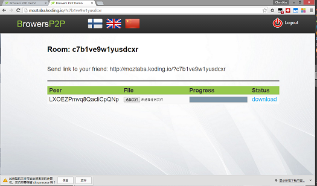

# Web Browsers P2P
>peer-to-peer file transfers between browsers

IT Infrastructure

| Name          | ID      | Email                    |
|---------------|---------|--------------------------|
| ChenXin       | 2439271 | dbchenxin@gmail.com      |
| Liang Shulang | 2441816 | liangshulang@hotmail.com |
| Li Wen        | 2441803 | 8717183@qq.com           |

##Introduction

We choose this topic because we always have trouble while we send big files to friends who live in China.
We usually share files by using dropbox, gDrive or something, unfortunately all of them are blocked in China. 
Although we can upload it to my webserver but they don't have. So we want to write something that can share files with friends online.

We archived Peer-to-Peer file transfer between web browsers. 
Here is the same stuff what we are going to do [reep.io](https://reep.io/).
And here is our [Online Demo](http://doubleshift.github.io/WebBrowsers-P2P/).

##Dependencies

Thanks for HTML5, we have webRTC. At first, we aimed at Websocket which just like socket. But you still need a file server to establish connection with peers. After that we changed to use webRTC which can be used to listen a port on your browser. By using webRTC, data could transfer between browsers without any data servers.But we still need a server for signal and nat.

- [jQuery](https://jquery.com/) 
> jQuery is a fast, small, and feature-rich JavaScript library. It makes things like HTML document traversal and manipulation, event handling, animation, and Ajax much simpler with an easy-to-use API that works across a multitude of browsers. 

- [simplyWebRTC](http://simplewebrtc.com)
> WebRTC is a free, open project that provides browsers and mobile applications with Real-Time Communications (RTC) capabilities via simple APIs. The simplyWebRTC make it easier to use the WebRTC api and cross the browsers.

- [GoogleFonts](https://www.google.com/fonts)
> Make the web pages looks better.

##Browers Support
We have used webRTC so it depends which brower supports webRTC.
But we are sure it could run on Chrome 41+.

You can find more information on:
- [iswebrtcreadyyet.com](http://iswebrtcreadyyet.com/)
- [simplewebrtc.com](http://simplewebrtc.com/)

##Features
Actually, this version is not a full version. You can share files to friends without any servers but it is not a peers-to-peers network. Which means the content serving capacity can't actually increase as more users begin to access the content. Maybe we can archive this part after half a year or longer?

##Instructions
1. Open the website and click the start button to create a room for your friends.
2. Now you have created a room, send the link to your friends so that they can get into your room with it.
3. You can see each others who have visit the link on the list.
4. Click the button to send them a file.
5. Download the file who sent it.
6. You can also share the file with more than two friends.

##Demo
Please visit [Online Demo](http://doubleshift.github.io/WebBrowsers-P2P/).
You can open two browser tabs for test.

##Code
You can always download the latest source code [here](https://github.com/DoubleShift/WebBrowsers-P2P/archive/master.zip)

##References
1. [peerjs](http://peerjs.com/)
2. [webRTC](http://www.webrtc.org/)
3. [Getting Started with webRTC](http://www.html5rocks.com/en/tutorials/webrtc/basics/)
4. [webRTC prototype 1.0](http://www.w3.org/TR/webrtc/)
5. [simply webRTC](http://simplewebrtc.com/)
